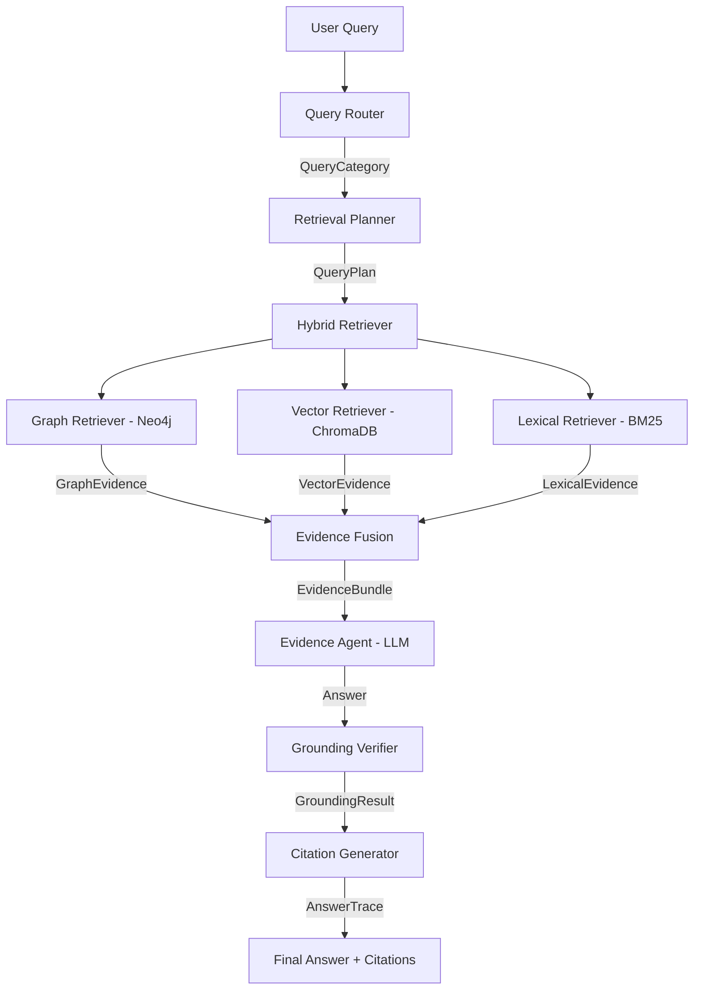

# Synapse — System Architecture

## Overview

Synapse is a neuro-symbolic retrieval-augmented generation (RAG) system
for evidence-grounded question answering.  It combines three retrieval backends
(knowledge graph, dense vector, BM25 lexical), evidence fusion, LLM-based synthesis,
and best-effort grounding verification.

Healthcare is the current demonstration domain.  The core architecture is
domain-agnostic — healthcare-specific mappings are isolated in a pluggable
domain adapter (`domain/healthcare.py`).

## Data Flow

## Component Responsibilities

### Query Router (`agents/router.py`)
- Classifies queries into 5 categories: `direct_lookup`, `semantic_search`,
  `relational_query`, `multi_hop`, `ambiguous`
- Primary: LLM-based classification (Groq)
- Fallback: rule-based keyword matching
- Routing decisions are logged and evaluable

### Retrieval Planner (`agents/planner.py`)
- Converts a QueryCategory into a structured QueryPlan
- Determines which retrieval sources to activate
- Sets reranking and verification requirements

### Retrieval Layer (`retrieval/`)
- **Graph Retriever**: exact→alias→fuzzy→BM25 candidate cascade, cross-encoder
  reranking, bounded Cypher graph expansion
- **Vector Retriever**: exact name lookup, composition matching, semantic search
  (embed→ANN→rerank)
- **Lexical Retriever**: BM25 over the full document corpus
- **Hybrid Retriever**: orchestrates all three based on the QueryPlan

### Evidence Fusion (`grounding/evidence_fusion.py`)
- Min-max score normalisation per source type
- Source-weighted scoring (configurable weights)
- Deduplication across sources
- Unified ranking → EvidenceBundle

### Evidence Agent (`agents/evidence_agent.py`)
- LLM tool-calling loop (Groq, up to 6 rounds)
- Domain-agnostic tool definitions
- Malformed tool-call recovery
- Produces AnswerTrace with full provenance

### Grounding Verifier (`grounding/verifier.py`)
- Extracts claims from generated answers
- Checks each claim against evidence via keyword overlap
- Classifies claims as supported/partially_supported/unsupported
- Best-effort — not a hallucination guarantee

### Domain Adapter (`domain/healthcare.py`)
- Healthcare-specific entity types, relationships, prompts, and tool labels
- Swappable for other domains

## Configuration

All tuneable parameters live in `core/config.py` as Pydantic BaseSettings:
- Database URIs and credentials
- Model names (embedding, reranker, agent, judge)
- Retrieval parameters (top-k, candidate pool, similarity thresholds)
- Fusion weights
- Agent settings (temperature, max rounds)
- API host/port

Values come from environment variables (`.env` file) with sensible defaults.

## Typed Data Models

Every inter-component boundary uses Pydantic models (`core/models.py`):
- `QueryPlan` — what to retrieve and how
- `RetrievalCandidate` — one candidate from any source
- `GraphEvidence`, `VectorEvidence`, `LexicalEvidence` — typed evidence
- `EvidenceBundle` — fused multi-source evidence
- `Citation` — claim→evidence mapping
- `AnswerTrace` — full provenance for one query→answer cycle
- `EvaluationRecord` — per-query evaluation metrics
